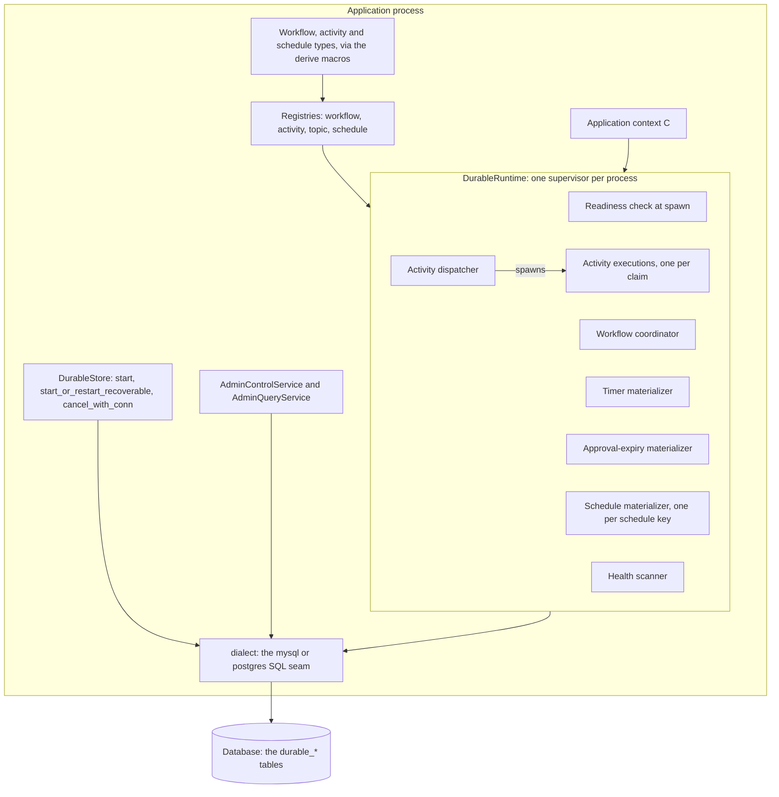
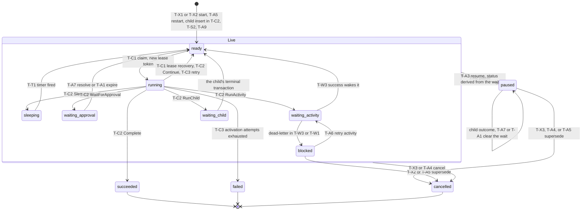
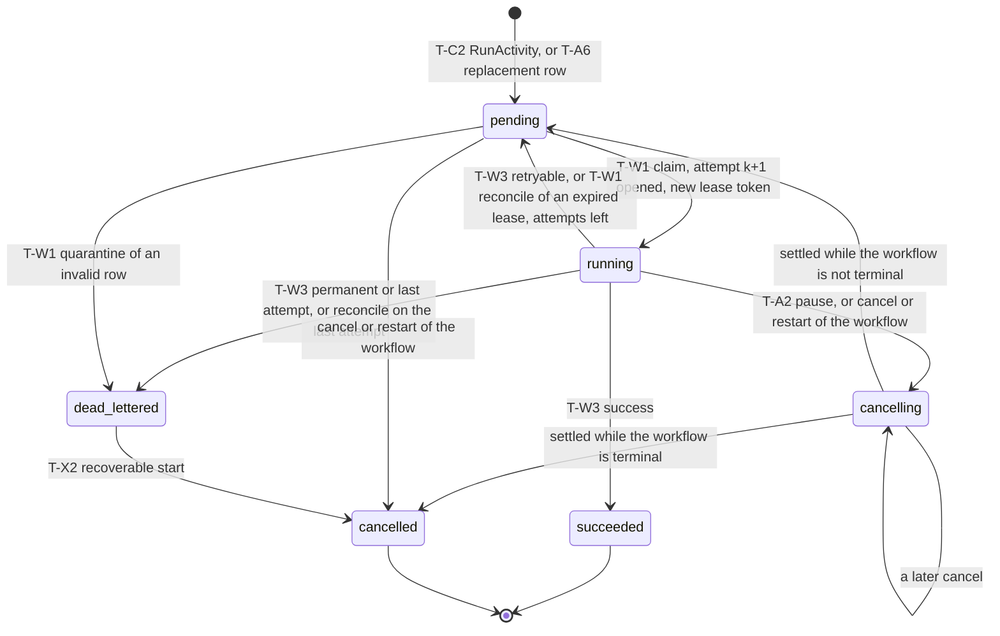
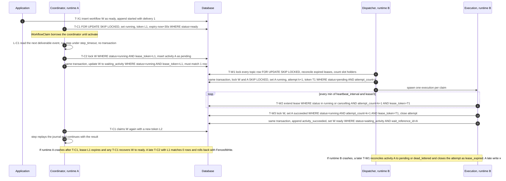
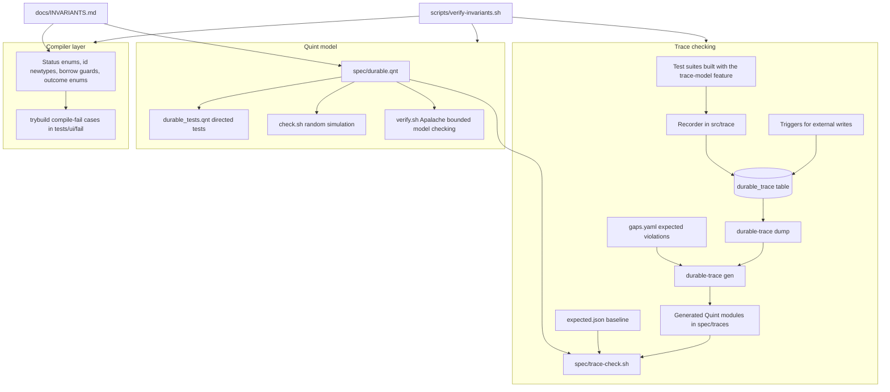

# Architecture

This page explains how the engine works, for a new contributor or user. It
describes the code as it is. The precise rules live in
[`INVARIANTS.md`](INVARIANTS.md); this page uses the same transaction names
(T-X1, T-C2, T-W3, ...) and invariant ids (S1, L4, G11, ...) so that you can
look each claim up there.

## 1. Overview

`durable-workflows` is an embedded engine: workflows, activities, timers,
approvals and cron schedules are rows in your own MySQL or Postgres database,
and a runtime inside your process moves them forward. Every state change is
one database transaction. Its guarantees, all from
[INVARIANTS §3](INVARIANTS.md#3-safety-invariants):

- **Workflow transitions are fenced.** A coordinator claims a workflow with a
  lease token, and every write it makes is fenced on
  `status = running AND lease_token = <its token>` (S1, S2). The event a step
  consumes, the new state and the commands it emits commit in one
  transaction (S4), so each event is consumed at most once. A `step` can run
  more than once for the same event after a lease expires, so it must be
  side-effect free (S3).
- **Activities are at-least-once.** Each claim is an attempt with its own
  lease token. A stale lease cannot commit, heartbeat or report progress
  (S10); attempts are bounded (S12); a result that commits after the lease
  was reconciled is rejected and the activity runs again (S13). The engine
  stores an `operation_key` and passes it to the handler, but it deduplicates
  nothing; idempotency is the handler's job (S34).
- **Results are delivered at most once.** An activity success (S16) and a
  child outcome (S23, S24) reach the waiting workflow once, in the same
  transaction that ends the wait.
- **Journaled flow steps never re-run** (S33), each schedule occurrence
  materializes at most once (S26), and topic concurrency caps hold at claim
  time (S17; the G7 overrun is closed under READ COMMITTED).

## 2. Components

- **Definitions.** `#[derive(DurableWorkflow)]` plus a hand-written
  `WorkflowHandler::step`, or the `#[durable_flow]` attribute on an
  `async fn`, defines a workflow kind and version. `#[derive(DurableActivity)]`
  names an activity's kind, version, topic, attempts, timeout, lease and
  backoff, and `ActivityHandler::execute` runs it. `#[derive(DurableSchedule)]`
  defines a cron schedule. The macros live in `durable-workflows-macros/`.
- **`DurableStore`** is the application API: `start` / `start_with_conn`
  (T-X1), `start_or_restart_recoverable` (T-X2), and `cancel_with_conn`
  (T-X3). The `*_with_conn` methods run inside the caller's transaction.
  There is no signal API; approvals are resolved through the admin service.
- **`DurableRuntime::spawn`** reconciles every schedule's state row (T-S1),
  seeds the topic lock rows, and runs the readiness check: it refuses to start
  when non-terminal work in the database needs a workflow, activity or topic
  that this process has not registered. Then the supervisor
  (`src/runtime/supervisor.rs`) spawns its tasks: the activity-execution
  manager, the coordinator, health, timer, approval-expiry, one schedule task
  per key, and the activity dispatcher. A failed task restarts after
  `restart_backoff`; more than `max_task_restarts` restarts of one task within
  `restart_window` cancel the runtime (INVARIANTS §2.1).
- **Admin.** `AdminControlService` pauses, resumes, cancels and restarts
  workflows, retries dead-lettered activities, resolves approvals, and
  pauses, resumes or runs schedules (T-A2 to T-A9). `AdminQueryService` is
  read-only (lists, timelines, topic and schedule metrics).
- **Observability.** The health task scans for missing workflow or activity
  definitions and topics, exhausted activations, dead-lettered activities
  with no successful retry, and stale workflows and activities (a lease that
  expired more than `health_stale_after` ago), logs a `HealthScanReport`, and
  passes it to an optional `HealthAlertSink`.

### Tables and their writers

The schema is one baseline migration per backend under
[`durable-workflows/migrations/`](../durable-workflows/migrations).

| Table | Holds | Written by |
|---|---|---|
| `durable_workflow` | One row per workflow run: status, wait (`wait_kind`, `wait_reference_id`), `available_at`, lease, `command_sequence`, `delivered_event_sequence`, state, dedup key, lineage (`root`, `restarted_from`, `parent`), schedule run | store (T-X1 to T-X3), coordinator (T-C1 to T-C3, child rows), activity worker (wake, block), timer (T-T1), approval expiry (T-A1), schedules through `start_occurrence` (T-S2), admin |
| `durable_workflow_event` | Per-workflow log. Deliverable events carry a `delivery_sequence`; history events do not | every writer of `durable_workflow` |
| `durable_activity` | One row per activity command (`replacement_number` counts operator retries): status, attempts, lease, retry policy, operation key | coordinator inserts (T-C2); activity worker (T-W1 to T-W3); store (T-X2, T-X3); admin (T-A2, T-A4 to T-A6) |
| `durable_activity_attempt` | One row per claim: worker, token, heartbeat, outcome | activity worker only: opened by T-W1, heartbeat by T-W2, closed by T-W3 or reconcile |
| `durable_progress_event` | Up to 100 progress events per attempt | the handler's `ProgressReporter` (T-W4) |
| `durable_approval` | Approval requests and decisions | coordinator (T-C2), admin resolve (T-A7), approval expiry (T-A1), cancel |
| `durable_schedule_state` | Per schedule key: the cursor, pause, pinned version and fingerprint | spawn and schedule task (T-S1, T-S2), admin (T-A8) |
| `durable_schedule_run` | One row per occurrence (unique on key and local occurrence) | schedule task (T-S2), admin run-now (T-A9) and restart (T-A5) |
| `durable_topic_lock` | One row per topic with its `max_concurrency`; used only as the claim mutex | `TopicRegistry::seed_locks`; locked by T-W1 |

## 3. Workflow lifecycle

`WorkflowStatus` is in `src/persistence/mod.rs`. The terminal statuses
(`succeeded`, `failed`, `cancelled`) are absorbing (S6). Every non-terminal
status except `paused` can be paused (T-A2), and every non-terminal status can
be cancelled (T-X3, T-A4). The composite state `Live` below stands for the
non-terminal statuses other than `paused`.

A workflow's wait fields always match its status (S7): `waiting_activity`
and `blocked` point at an activity, `waiting_child` at a child, `sleeping` at
the timer's command sequence, and `waiting_approval` at an approval. A paused
workflow keeps its wait, so resume can restore it. There is no workflow lease
renewal: a lease ends when T-C2 or T-C3 commits, or when it expires and any
coordinator's T-C1 recovers it (L2). T-C3 counts activation attempts (a
handler error, a `step` panic or a `step_timeout`); lease recovery does not
(S8).

## 4. Activity lifecycle

`ActivityStatus` is in `src/persistence/mod.rs`. `running` and `cancelling`
hold a lease (`ActivityStatus::LEASE_HOLDERS`) and a topic slot
(`SLOT_HOLDERS`), and each has exactly one open attempt (S9, S11).

- **Attempts.** Only a claim increments `attempt_count` and opens an attempt
  row; `attempt_count <= max_attempts` (S12). A retryable failure goes back to
  `pending` with `available_at = now + backoff`. The last attempt
  dead-letters the activity and blocks its workflow for an operator.
- **Leases.** The claim sets `lease_expires_at = now + lease_duration` in
  database time. The execution heartbeats every
  `min(heartbeat_interval, lease / 3)` (T-W2) and gives up locally one
  millisecond before its lease would expire. When a lease expires, the next
  T-W1 sweep on that topic reconciles the row and closes its attempt as
  `lease_expired` (L5).
- **`cancelling` (N2).** A pause or a cancel does not free the row while the
  handler may still run. The row moves to `cancelling` and keeps its lease,
  its open attempt and its topic slot; the revoke's outcome
  (`operator_paused`, `operator_cancelled` or `application_cancelled`) is
  stored in `last_error_category`. The next heartbeat renews the lease and
  returns `Renewed::Revoked`, so the executor cancels the handler, waits at
  most `min(shutdown_grace, lease deadline)`, and finishes with
  `ExecutionOutcome::Revoked`. T-W3 then calls `settle_revoked`: it closes the
  attempt with the stored outcome and moves the row to `pending` (a paused
  workflow; claimable again once resumed) or `cancelled` (a terminal
  workflow). Whatever the handler returned is not applied (L12). If the
  executor is gone, the next T-W1 reconcile settles the row with
  `settle_revoked` once the lease expires, closing the attempt as
  `lease_expired` (L5).
  A pause also adds 1 to `max_attempts`, so the paused attempt does not use up
  the budget (S36).

## 5. One step, end to end

A workflow runs one activity and then continues. Runtime A's coordinator and
runtime B's dispatcher can be in different processes.

The fences are what make a stale actor harmless. A **fence** is a `WHERE`
predicate on an `UPDATE` whose affected-row count must be exactly 1;
otherwise the code returns `DurableError::FencedWrite` and the whole
transaction rolls back, including any rows it inserted (INVARIANTS
Conventions, S2, S10). `RunActivity` and `WaitForApproval` lock the workflow
under the fence before they insert, so a stale commit gets `FencedWrite` and
not a duplicate-key error (N4). Neither fence tests `lease_expires_at`: a
holder whose lease expired but has not been recovered yet can still commit,
by design (S2, S10). The coordinator treats `FencedWrite` and transient
database errors (deadlock, serialization failure, lock wait timeout) from
T-C2 and T-C3 as benign and goes on (G1, fixed).

## 6. Children, schedules, timers and approvals

**Child workflows.** `RunChild` (from `ctx.child` / `ctx.child_with_key` in a
flow) inserts the child row in the parent's T-C2 commit, with the dedup key
`child:{parentId}:{command}` or a caller-supplied domain key. A dedup hit
attaches to the newest recovery generation of the existing row and must match
its version (G6, fixed); a key that resolves to the caller or an ancestor is
an activation failure (G8, fixed). When the child becomes terminal, the same
transaction wakes every parent that waits on it with `child_succeeded` or
`child_failed` (L11). Both paths lock the child before the parent (G9, fixed;
[INVARIANTS §2.8](INVARIANTS.md#28-lock-order-summary)). A parent that
attaches to a child that is already terminal wakes itself in its own commit
(S24). **There is no cancel cascade:** cancelling or superseding a parent does
not cancel its children, and the parent drops their later outcomes (G11,
[INVARIANTS §6](INVARIANTS.md#6-suspected-gaps)).

**Schedules.** Each schedule key has one runtime task. At spawn and on each
tick, T-S1 inserts or upgrades the `durable_schedule_state` row; a new version
moves the cursor to the first occurrence after `now` that is strictly after
the last materialized occurrence (S27, S30). The cursor is a `ScheduleCursor`
(`src/schedule/cursor.rs`); only its constructors and `advance_to` set it. T-S2 locks
the state row, requires the pinned version and fingerprint, returns if the
schedule is paused, and applies the overlap policy (`Allow`, `SkipIfActive`,
`QueueOne`) and the misfire policy (`Skip`, `RunLatest`, `CatchUp`). For each
due occurrence (at most 10,000 per chunk) it inserts a `durable_schedule_run`
row and, to start it, calls your `ScheduleHandler::start_occurrence` on the
same connection. It then advances the cursor with a fence on the old cursor,
version and fingerprint. A failed tick rolls back its run rows and cursor
together (S26, S27). Admin run-now (T-A9) inserts a `manual:{t}` run. It
returns `Conflict` when the overlap policy is `SkipIfActive` or `QueueOne` and
a run is active, and it ignores the pause on purpose (G12).

**Timers.** Timers have no table. `SleepUntil` sets the workflow to `sleeping`
with `wait_kind = timer`, `wait_reference_id = command_sequence` and
`available_at = wake time`. The timer task (T-T1) picks one due row
`FOR UPDATE SKIP LOCKED`, appends `timer_fired` and moves it to `ready`. A
paused workflow's timer does not fire, and resume restores `sleeping` (S22).

**Approvals.** A `WorkflowHandler` returns `WaitForApproval`, which inserts a
`durable_approval` row as `pending` with an optional expiry (flows do not
support approval waits). `AdminControlService::resolve_approval` (T-A7)
resolves it only while it has not expired; the approval-expiry task (T-A1)
expires it only when `expires_at <= now`. Both lock the workflow first, and
each is fenced on `status = pending`, so exactly one of them wins (S20).

## 7. Concurrency model

- **READ COMMITTED.** Every transaction the library opens runs at READ
  COMMITTED (`dialect::transaction`). The `*_with_conn` methods run at the
  caller's isolation level; see the contract in the README and
  [INVARIANTS §5.1](INVARIANTS.md#51-database).
- **Leases and fences.** A lease is a random UUID token plus a database-time
  expiry. Only one transition issues a token (`ready → running` for a
  workflow, `pending → running` for an activity), under
  `FOR UPDATE SKIP LOCKED` plus a status fence (S1, S9). Every later write by
  the holder carries the token in its fence.
- **Lock order.** Claims: topic rows, then workflow, then activity, then the
  attempt insert. Finish, reconcile, pause, cancel and retry: workflow, then
  activity, then attempt. A child's terminal commit and a parent that attaches
  to an existing child both lock child, then parent. Schedules: state, then
  run rows, then new workflows. Details in
  [INVARIANTS §2.8](INVARIANTS.md#28-lock-order-summary).
- **Lock witnesses.** Every library transaction callback receives a
  `tx::Tx { connection, scope }`. The `scope` token brands the transaction.
  A row read `FOR UPDATE` through `tx::lock_*` becomes a
  `Locked<'tx, Row>`, which cannot leave its transaction. The functions that
  depend on an earlier lock take the witness as a parameter, so a wrong lock
  order is a compile error. The command inserts need the claim fence (N4),
  and a parent's child wait needs the locked existing child (G9). The SQL
  fences stay; a witness does not prove what the database contains
  ([INVARIANTS §2.8](INVARIANTS.md#28-lock-order-summary)).
- **One workflow claim per coordinator.** `WorkflowCoordinator::claim_one`
  takes `&mut self` and returns a `WorkflowClaim` that borrows the
  coordinator until `WorkflowClaim::activate` consumes it. A second claim
  while one is alive is a compile error (E0499, the trybuild case
  `coordinator_second_claim_while_claimed`). This matches the model's
  one-claim-per-runtime rule. The coordinator is one sequential loop per
  runtime; dropping a claim releases nothing, and the row waits for lease
  recovery.
- **Activity claims come in batches.** The dispatcher computes its free
  local capacity and calls `claim_batch` (T-W1), which locks **every**
  registered topic row with `SKIP LOCKED` and claims nothing unless it gets
  all of them. Under those locks it reconciles expired leases, counts the
  topic's slot holders, and claims at most
  `min(cap - in_flight, local capacity, remaining batch)` rows per topic. Each
  claim runs as its own execution task with its own heartbeats, so many
  activities run at once while the topic cap still holds across processes
  (S17, L4).
- **Two clocks.** Every persisted time and every due or expiry comparison
  uses the database clock: `UTC_TIMESTAMP(3)` on MySQL,
  `clock_timestamp() AT TIME ZONE 'UTC'` on Postgres. Process time (tokio `Instant`) is only for
  local deadlines, timeouts, heartbeat cadence, grace periods and sleeps. The
  one-handler-per-activity rule (S13) assumes the process clock does not run
  slower than the database clock ([INVARIANTS §5.2](INVARIANTS.md#52-clocks)).

## 8. Backends

Each build targets one database. The cargo features `mysql` and `postgres`
(the default) are mutually exclusive; `src/dialect/mod.rs` makes both or
neither a `compile_error!`. `DurableConnection` is the backend's own
diesel-async connection, so the public API is not generic.

The `dialect` module is the only place that names a backend. It isolates:

- `transaction`: the library-owned transaction, pinned to READ COMMITTED;
- `now_millis`: the database clock;
- `insert_workflow` (insert or find on the dedup key) and the new-row inserts
  for activities, approvals and schedule runs;
- the insert-if-absent writes for schedule state and topic lock rows;
- `is_transient_error`, and `is_unique_violation` in `mod.rs`.

The migrations exist once per backend. The test-only features `fake-clock`
(overrides the database clock) and `trace-model` (records traces) must never
be enabled in production. The reasoning is in
[`design/multi-backend.md`](design/multi-backend.md).

## 9. Verification architecture

Each invariant is enforced by the strongest mechanism available: first the
type system, then SQL fences and constraints, then the model and trace
checking ([`CLAUDE.md`](../CLAUDE.md), "Rely on the compiler first").

- **Compiler layer.** Status enums are matched exhaustively, and each status
  set constant (`SLOT_HOLDERS`, `LEASE_HOLDERS`, `TERMINAL`, ...) is checked
  against its predicate at compile time. Borrow guards, one-shot methods and
  private constructors make wrong uses fail to compile, and every such
  guarantee has a trybuild case under `durable-workflows/tests/ui/fail/`.
- **Quint model.** `spec/durable.qnt` has one action per database transaction
  (T-W1 is split by statement group) and the S, G and N invariants. It is
  checked by directed tests, random simulation (`spec/check.sh`) and bounded
  model checking with Apalache (`spec/verify.sh`); see
  [`spec/README.md`](../spec/README.md).
- **Trace checking.** With `trace-model`, every engine transaction writes one
  `durable_trace` row in the same transaction: its model action (`TC1_Claim`,
  `TW3_Finish`, ...), what it read, and the post-image of each row it wrote.
  Triggers record writes that tests make directly. `durable-trace dump` writes
  one JSON trace per test database, `gen` turns each into a Quint module, and
  `trace-check.sh` replays them against the model and compares the counts with
  `spec/traces/expected.json`. Gap tests in `tests/gaps.rs` must show the
  violation that `spec/traces/gaps.yaml` names.
  `scripts/trace-pipeline.sh <backend>` runs the whole chain; see
  [`TRACE_CHECKING.md`](TRACE_CHECKING.md).
- **Runners.** `scripts/verify-invariants.sh` runs fmt, clippy, docs, both
  test suites, the Quint checks (`--full` adds a larger simulation and
  Apalache) and trace checking on each backend. CI runs `lint`, `test-mysql`
  (8.0, 8.4), `test-postgres` (14, 17) and, after the tests pass,
  `trace-check` (MySQL 8.4 and Postgres 17). A nightly job runs the trace
  pipeline with the concurrent workload. The Quint simulation and Apalache
  are not CI jobs; they run through `verify-invariants.sh`.

## 10. Where to read next

- [`INVARIANTS.md`](INVARIANTS.md): the state machines, every transaction
  step by step, the safety and liveness properties, and the known gaps (§6).
- [`design/multi-backend.md`](design/multi-backend.md): why one backend per
  build, and the per-backend SQL.
- [`design/trace-checking.md`](design/trace-checking.md) and
  [`TRACE_CHECKING.md`](TRACE_CHECKING.md): the design and the how-to of trace
  checking.
- [`spec/README.md`](../spec/README.md): what the Quint model covers and its
  results.
- [`CONTRIBUTING.md`](../CONTRIBUTING.md): setup and how to change behavior.
